# Curso BackEnd -  1º Semestre - 105h

Prof. Diogo Barbosa

Escola SENAI Americana 

2º Semestre 2026

## Objetivos do Curso

- Desenvolver Aplicações web Server Side, utilizando a linguagem PHP;
- Aplicar Sintaxe nativa Php Vanilla;
- Manipulação HTTP;
- Persistência de Dados(Armazenamento em BD);
- Segurança contra SQL Injection/CSRF;
- Refatoração em POO (Programação Orientada Objeto);
- Arquitetura MVC;
- Utilização do FrameWork Laravel;

## Cronograma do Semestre

Carga Horária: 105h

Duração: 20 Semanas

### Semana 1: Introdução ao BackEnd e Configuração do Ambiente PHP

#### O que é BackEnd

O back-end é a parte de um site ou aplicativo que o usuário não vê, mas que faz tudo funcionar por trás das telas.

- Guarda e organiza informações em um banco de dados;
- Confere se o login e a senha estão corretos;
- Calcula valores, como o frete ou o total de uma compra;
- Garante que os dados de um usuário não apareçam para outro;
- Faz o sistema suportar muitas pessoas usando ao mesmo tempo, sem travar.

As principais linguagens utilizadas no desenvolvimento back-end são PHP, JavaScript/TypeScript, Python, Java, Kotlin, Go (Golang), C# e Rust. 

O backend é o "cérebro" oculto de um site ou aplicativo. Ele roda em um servidor e cuida de tudo o que o usuário não vê na tela.

**As 3 partes básicas de todo backend:**

1. **Servidor:** o "computador" que fica ligado esperando pedidos (requisições);
2. **Banco de dados:**  onde as informações ficam guardadas (usuários, produtos, mensagens, etc.);
3. **Lógica de negócio:**  as regras do sistema (ex: "não deixa comprar se não tiver estoque").

**O Mercado de Trabalho em Back-end**

O desenvolvimento Back-end é uma das áreas mais cruciais da Tecnologia da Informação. 

- Com a transformação digital acelerada, empresas de todos os portes e setores dependem de infraestruturas sólidas e seguras. 

- Setores de Atuação: Bancos, hospitais, e-commerces, logística, indústrias, startups e órgãos públicos utilizam Back-end para suportar suas operações críticas.

- Fatores de Crescimento: O avanço da computação em nuvem, aplicativos móveis, Big Data e IA impulsiona continuamente a busca por profissionais da área.

- Modelos de Trabalho: Alta flexibilidade com vagas presenciais, híbridas e remotas (inclusive com oportunidades internacionais).

#### Ciclo de Vida da Requsição HTTP

##### O que é HTTP

**HTTP**, Hypertext Transfer Protocol, é um protocolo de comunicação utilizado para transferência de informações na WWW(World Wide Web) e em outros sistemas de Redes.

O HTTP é a base para que o cliente e um servidor web troquem informações. Ele permite a requisição e a respostas de recursos, como imagens, arquivos e as própias páginas web, por meio de mensagens padrão (protocolo).

##### Como Funciona o HTTP

1. O cliente estabele contato com o servidor, encamihando uma requisição HTTP;
2. Nessa Requisição o cliente especifica o método pretendido (read-GET, create-POST, update-PUT/PATCH, delete-DELETE)
3. o Servidor processa e responde com uma mensagem HTTP, com os recursos solicitado.

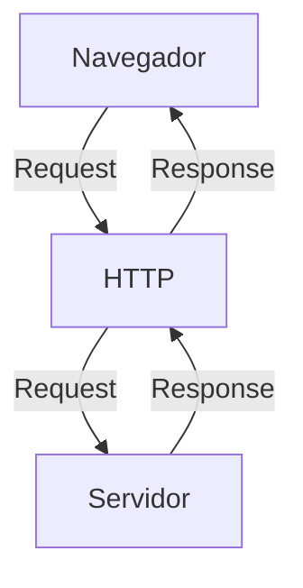
---
#### Como funciona na prática o BackEnd
- **Ação do usuário:** Envia uma solicitação pela UI (Interface do Usuário). Exemplo de UI: Tela do celular, Navegador da Internet, Alexa, ...
- **Envio da requisição:** A UI transforma ação do usuário em uma requisição HTTP.
- **O Processamento BackEnd:** o Código BackEnd recebe o pedido, valida os dados e decide o que fazer (Ex: consulta uma informação no banco de dados).
- **Resposta:** o servidor devolve o resultado para UI (Ex: Um login autorizado, uma compra confirmado, uma música, ...).

## Tipos de Requisição HTTP
Os tipos de requisição HTTP indicam uma ação que o usuário deseja executar no servidor. As principais ações são: 

- **GET**: Pede dados de um lugar especifico. "Não Faz Alterações no Servidor"
- **POST:** Envia dados novos para *criar* algo ou processar informações.
- **PUT/PATCH:** Modificar dados ja existentes. *PUT* Atualização Total dos dados. *PATCH* Atualização Parcial dos dados.
- **DELETE:** Apaga um dado do Servidor


---

### Iniciando o PHP

### O que é PHP

**PHP** (Hypertext PreProcessor) é uma liguagem de programação interpretada e open source, focada no desenvolvimento de sistemas para web, pode ser usada junto com HTML para criação de págians web dinâmicas.

### Instalando o PHP

- Fazer o Download do PHP (php.net);
- ZIP - Non Thread Safe 8.5
- Descompactar o arquivo do PHp na pasta C:\src\php (Para descompactar, usar 7zip)
- Modificar o arquivo php.ini-development para => php.ini (criar as configurações do PHP na máquina) - adicionar ou remover funcionalidades do PHP
- Adicionar a pasta do PHP (C:\src\php) as Variaveis de Ambiente do Sitema (PATH) 
- Verificar a instalação rodando o comando php --version

### Contextualizando o PHP

O PHP de fato é uma das linguagens de programação mais populares da atualidade. Ela permite que você crie aplicações web robustas, muito simplificada direto ao ponto. Sem contar que a linguagem traz diversos recursos que facilitam e aceleram o processo de desenvolvimento de sites e sistemas para web. E além do mais, ela ainda tem um ótimo ecossistema, uma excelente comunidade e um grande mercado de trabalho.

### Criando minha primeira aplicação em PHP

Criando um Hello, World!!!

### Criando o perfil de PHPVanilla

-> Profile -> New Profile
-> Extensions:
- PHP IntePhense (A do elefantinho) : Autocomplear (snipets)
- PHP Debug (Xdebug): Acha erros em linha de código
- PHP CS FIXER: Formatação padrão do código (identação)
- PHP Serve: Sobe um serivdor local para acompanhamento em tempo real
---
### Estudo de Constantes e Variáveis em PHP 

Declarar variáveis é alocar um espaço na memória que permite a inclusão e manipulaçã de dados.

**Variáveis**

- devem ser declarados usando "$" antes do nome da variável
- podem ser String, Numérica (Integer e floar), Booleanas e Nulas. Não permite a declaração de Undefined
- são não tipadas (não precisa declarar um tipo na criação), a tipagem é atribuida ao adicionar o valor
- usar o "declare(strict_types=');" na primeira linha do arquivo ; => blindar o sistema contra conflitos de tipos de variáveis.

**Constantes**

- não podem ser modificadas ou redeclaradas após a criação
- pode ser criada usando "const" ou "define"
- não permitem interpolação

---

### Semana 2 - Operadores em PHP (Aritméticos, Relacionais e Lógicos)

#### Estudo de Operadores 

 **Aritméticos**: São usados para realizar cálculos.
 
 | Operador | Nome | Exemplo | Resultado |
 | - | - | - | - |
 | + | Adição| 10 + 5 | 15 |
 | - | Subtração | 10 - 5 | 5 |
 | * | Multiplicação | 10 * 5 | 50 |
 | / | Divisão | 10 / 5 | 2 |
 | % | Módulo (Resto) | 10 % 3 | 1 (10 div 3 da 3, sobra 1) |
 | **| Expoente | 2 ** 3 | 8(2 elevado a 3) |
 
 
 `obs:` O Operador é o melhor  amigo de um programador, permite ordenar listas e organizar fila e pilhas.

 **Relacionais**: São utilizados para comparar e relacionar dois ou mais valores ou informações, o resultado de uma operação relacional é sempre uma booleana (true, false)

 | Operador | Nome | Exemplo | Resultado |
 | - | - | - | - |
 | < | Menor que | 5 < 10 | True |
 | > | Maior que | 5 > 10 | False |
 | <= | Menor ou igual | 10 <= 5 | False
 | >= | Maior ou igual | 18 >= 18 | True |
 | == | Iguais | "10"==10 | False |
 | === | Igualdade Estrita | "10"===10 | False |
 | != | Diferente | "10"!=10 | False |
 | !== | Diferença Estrita |"10"!==10 | True |

 **Lógicos**: Permite a combinação entre sentenças.

 - operador `AND` (E) => && : para o resultado ser verdadeiro, TODAS as Combinações precisam ser verdadeiras
  - true && true => true
  - true && false => false

  - Operador `OR` (OU) => || : para o resultado ser verdadeiro, basta APENAS UMA condição ser verdadeira
  - false || true => true
  - false || false => false

  - Operador `NOT` (Não) => ! : Inverte a lógica da Sentença
  - !true => false
  - !false => true 
  --- 
### Semana 3 - Estrutura de Controle de Dados (Condicionais e Repetição)

- **Conteúdo**: Extruturas `if`, `else`,`elseif`, operadores ternários, `match` => substituto do `switch/case`, loops `for`, `while`, `do-while` e `foreach`

#### Estrutura de Controle de Dados ajudam no precesso de automatização em programa e sistemas

#### Condicionais (IF, ELSE, ELSEIF)

- **Forma de Uso**: 

- Uso do `if` apenas:
Exemplo: aplicar uma desconto do 10% em comprar acima de 100 reais;

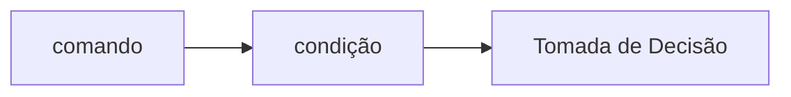

```php
if ($valorCompra > 100) {
    $valorCompra = $valorCompra * 0.1
}
```

- Uso do `if` seguido do `else`
Exemplo: aplicar um desconto de 10% para compras de acima de 100 reais e 5% para as demais compras

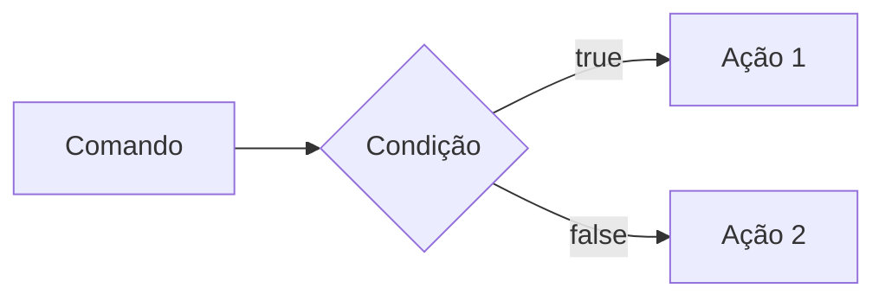

```php
 if($valorCompra > 100) {
    $valorFinal = $valorCompra*0.1;
 } else{
    $valorFinal = $valorCompra*0.05;
 }

 ```

- Uso do `elseif` (Encadeado)
Exemplo: Compras acima de 200 reais tem 15% de desconto, acima de 100 reais 10% de desconto e qualquer outra compra vai ter 5% de desconto

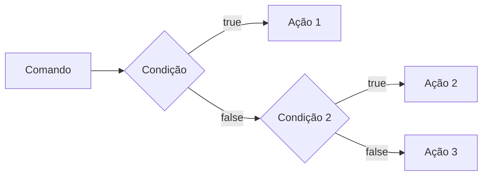

```php
if($valorCompra > 200){
    $valorFinal = $valorCompra*0.85;
} elseif($valorCompra > 100) {
    $valorFinal - $valorCompra*0.9;
} else {
    $valorFinal = $valorCompra*0.95;
}

```

*Obs*: sempre usar `elseif` para situações que precisam de mais de uma condição, ou seja, fazer encadeamento das condições.

- Uso **ERRADO** do if

Não fazer o encadeamento de condicionais

```php
if($valorCompra > 200) {
    $valorFinal = $valorCompra*o.85;
}
if($valorCompra > 100) {
    $valorFinal = $valorCompra*0,90;
}
if($valorCompra < 100) {
    $valorFinal = $valorCompra*0.95;
}

```

#### Operadores Ternários
Um atalho para a estrutura condicional `if/else`, normalmente escrito em uma única linha de código

` condição ? verdadeira : falso`

Perfeito para decisões curtas de uma linha de comando
Exemplo: Verificar se a pessoa é maior de idade (18)

```php

$idade = 20;
//O formato é : (Condição) ? Verdadeiro : Falso;

$status = ($idade >= 18) ? "Maior de Idade" : "Menor de Idade;
$status2 =($idade<18) ? "Criança" : ($idade<60) ? "Adulto" : "Idoso";

```

#### Expressão Condicional `match` (PHP 8)

No mercado de PHP atual não se usa mais uma de zena de `if/elseif` para checar valores fixos, e o antgo `switch/case` caiu em desuso. Agora usamos o `match`. Ele retorna diretamente o resultado.

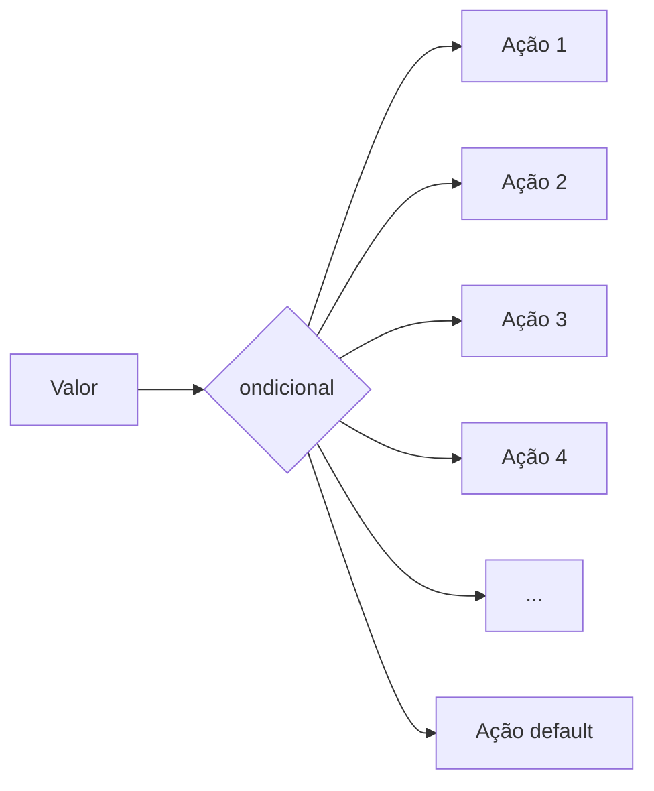

```php
$diaSemana = date("Week"); //Pega o dia da semana em formato numérico

//Transformar dia da semana em formato texto (Domingo,Segunda,...)

$nomeDiaSemana = match($diaSemana){
    "0" => "Domingo",
    "1" => "Segunda",
    "2" => "Terça",
    "3" => "Quarta",
    "4" => "Quinta",
    "5" => "Sexta",
    "6" => "Sábado",
    "defaut" => "Dia Inválido
};

```

---

##### Laços de Repetição

Um laço de repetição faz com que um bloco de códigos rode várias vezes, até que uma condição mande parar.

- o laço `while` (Enquanto)

Ele verifica se a cndição é verdadeira ANTES de entras no laço. Ideal quando você não sabe quantas vezes vai rodar o laço.

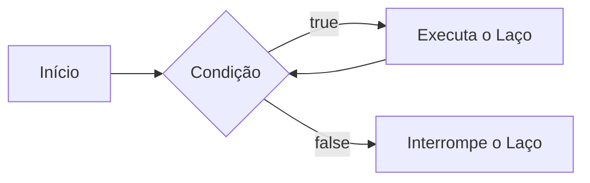

Exemplo (While): Jogo de Adivinhação de um nº Secreto   

```php

$numeroSecreto = 7;

$tentativas = 0;

while($tentativa != $numeroSecreto){
    echo "Tente Novamente"
    //vou pegar um nº aleatório entre 1 e 10
    $tentativa = rand(1,10); 
}

echo "Acertou! o nº secreto é $numeroSecreto";

```

- O laço `do-while` (Faça Enquanto)

A diferença é que ele executa o bloco pelo menos uma vez, mesmo que a condição seja falsa desde o início, pois ele só pergunta no final

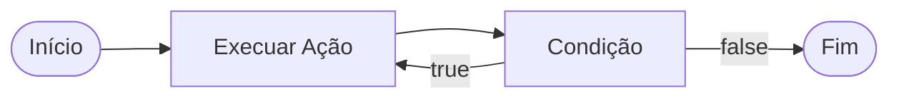

Exemplo: Jogo de Adivinhação

```php
$numeroSecreto = rand(1,10)

do {
    $tentativa = rand(1,10); //Simular um palpite aleatório

    if($tentativa == $numeroSecreto){
        echo"Parabéns, Acertou!";
    }
} while ($tentativa != $numeroSecreto);

```

obs: uso ideal do `do-while`, menus de sistema ou solicitações de dados, sistemas interativos; 

---

#### O Freio de Emergência: `break` e `continue`

Às vezes precisamos interferir no laço enquanto ele está rodando

- `break`=> **Para Tudo"** Quebra o laço inteiro e vai embora
- `continue`=> **Pula a rodada** Ele ignora código daquela rodada especifica e pula logo par a próxima repetição.

Exemplo de Aplicação do Código: Sistema de Controle do Elevador

```php 

for($andar = 1 ; $andar<=10; $andar++){
    if($andar ==4){
        echo "Andar $andar está em obras. Passando direto!";
        continue;
    }

    echo "Elevador parou no andar $andar"
}

```
---

##### Laço de Repetição `for`

Use o `for`quando você sabe qunatas vezes precisa repetir uma ação ou quando precisa controlar um contador. Ele possui 3 partes:

- inicialização;
- condição;
- incremento;

Sintaxe:

for(inicialização; condição; incremento;){
    Ação
}

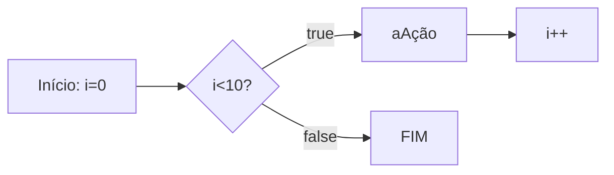

Exemplode aplicação: Exibir todos os meses do ano

```php
for($mes=1;$mes<=12;$mes++){
    echo "Mês $mes";
}
```
Nesse exemplo, `$mes` o laço continua enquanto o `$mes` for menor ou igual a 12 e, ao final de cada repetição, `$mes` aumenta o contador em 1

#### Laço de Repetição `foreach`

Use o `foreach` quando precisar percorrer cada item de um **array**. Ele acessa os elemntos diretamente sem que você precise controlar diretamente o contador.

Exemplo: Imprimir todos os itens de um vetor.

```php
$frutas = ["Maça","Banana","Uva","Laranja"];

foreach($frutas as $fruta){
    echo "Fruta:" $fruta;
}
```

Outro Exemplo: Acessar a chave e o valor de cada intem:

```php
$preços = [
    "Caderno" => 25.00,
    "Caneta" => 5.50,
    "Mochila" => 99.00
]; // Vetor não ordenado do tipo chave(Key) => Valor(value) ===> Coleção/Dicionário

//Percorrer o vetor usando o laço foreach
foreach($preços as $produto=>$preço){
    echo "$produto; R$" . number_format($preço,2);
}
// Acessa a chave e o valor de cada item do vetor

```

---
---

#### Desafio : Simuladr de cobrança (FINANSENAI)

#### Desafio Final

---
---

### Semana 4 - Modularização com Funções

#### Principio do DRY (Don't Repeat Yourself)

Se uma lógica foi escrita duas ou mais vezes dentro de um código, essa lógica deve virar uma função.

#### Funções Nativas do PHP

O PHP tem milhares de funções prontas, essa função já criada é chamada de função nativa.

- **O que é uma função?**

Uma função é como uma máquina: você coloca a matéria-prima (Parâmetro), ela processa e devolve um produto final (Retorno)

Exemplo de Função Nativa

```php
$texto = "senai americana";

// usar uma função nativapara substituição de parte do texto ==> str_replace
$textoNovo = str_replace("americana", "são paulo", $texto);
// "senai são paulo"

// usar uma função nativa para substituição das letras minúsculas por letras maiúsculas => strtoupper
echo strtoupper($textonovo); // SENAI SÃO PAULO
```

#### Principais Funções Nativas (Mais Utilizadas)

As funções abaixo já fazem parte do PHP e podem ser chamadas diretamente no código. Observe os parâmetros que cada uma recebe e o tipo de informação que ela retorna.

| Função | Categoria | O que faz | Como usar |
|---|---|---|---|
| `strlen()` | Strings | Retorna a quantidade de caracteres de um texto. | `$tamanho = strlen($texto);` |
| `strtoupper()` | Strings | Converte o texto para letras maiúsculas. | `$resultado = strtoupper($texto);` |
| `strtolower()` | Strings | Converte o texto para letras minúsculas. | `$resultado = strtolower($texto);` |
| `ucfirst()` | Strings | Converte a primeira letra do texto para maiúscula. | `$resultado = ucfirst($texto);` |
| `trim()` | Strings | Remove espaços e quebras de linha no início e no fim do texto. | `$limpo = trim($texto);` |
| `str_replace()` | Strings | Substitui uma parte do texto por outra. | `$novo = str_replace("-", "", $cpf);` |
| `substr()` | Strings | Extrai uma parte do texto a partir de uma posição. | `$inicio = substr($texto, 0, 3);` |
| `explode()` | Strings | Divide um texto e cria um array usando um separador. | `$palavras = explode(" ", $nome);` |
| `implode()` | Arrays | Junta os itens de um array em um único texto. | `$lista = implode(", ", $nomes);` |
| `count()` | Arrays | Conta a quantidade de itens de um array. | `$total = count($produtos);` |
| `in_array()` | Arrays | Verifica se um valor existe dentro de um array. | `$existe = in_array("SP", $estados, true);` |
| `array_push()` | Arrays | Adiciona um ou mais itens ao final de um array. | `array_push($nomes, "Ana");` |
| `array_pop()` | Arrays | Remove e retorna o último item de um array. | `$ultimo = array_pop($nomes);` |
| `sort()` | Arrays | Ordena um array em ordem crescente e reorganiza suas chaves. | `sort($notas);` |
| `array_keys()` | Arrays | Retorna um array contendo as chaves de outro array. | `$chaves = array_keys($produtos);` |
| `number_format()` | Números | Formata um número com casas decimais e separadores definidos. | `$preco = number_format($valor, 2, ',', '.');` |
| `round()` | Números | Arredonda um número para a quantidade de casas informada. | `$media = round($nota, 2);` |
| `max()` | Números | Retorna o maior valor de uma lista ou array. | `$maior = max($notas);` |
| `min()` | Números | Retorna o menor valor de uma lista ou array. | `$menor = min($notas);` |
| `is_numeric()` | Validação | Verifica se o valor é um número ou uma string numérica. | `if (is_numeric($entrada)) { ... }` |
| `isset()` | Validação | Verifica se uma variável existe e não possui valor `null`. | `if (isset($usuario)) { ... }` |
| `empty()` | Validação | Verifica se uma variável está vazia. | `if (empty($pedido)) { ... }` |
| `date()` | Data e hora | Formata uma data ou hora conforme uma máscara. | `$hoje = date('d/m/Y');` |
| `file_exists()` | Arquivos | Verifica se um arquivo ou diretório existe. | `if (file_exists('dados.txt')) { ... }` |
| `file_get_contents()` | Arquivos | Lê todo o conteúdo de um arquivo ou endereço. | `$conteudo = file_get_contents('dados.txt');` |
| `file_put_contents()` | Arquivos | Grava conteúdo em um arquivo, criando-o se necessário. | `file_put_contents('log.txt', $mensagem);` |

**Atenção:** algumas funções modificam o array original, como `sort()`, `array_push()` e `array_pop()`. Já outras retornam um novo valor, como `count()`, `explode()` e `str_replace()`. Em caso de dúvida, consulte a documentação oficial do PHP e verifique o retorno da função.

#### Documentação do PHP

[Acesse a documentação oficial do PHP em português](https://www.php.net/manual/pt_BR/)

Conculte também a [referência de funções do PHP em] (https://www.php.net/manual/pt_BR/funcref.php) para pesquisar a sintaxe, os parâmetros e os valores para cada função

#### Funções Customizadas (Criando suas próprias máquinas)

Quando o PHP não tem a função que queremos, nós a criamos!

**A Regra de Ouro**: Uma função deve focar em `return` (retornar um valor), e não imprimir (`echo`)

Veja a Diferença nesse exemplo:

```php
function calcularTotal($preco, quantidade){
    // a função calcula e retorna o resultado, mas não imprimi nada
    return $preco * quantidade;
}

$total = calcularTotal(25.00, 3);

// imprimir é feito fora da função
echo "Total da compra: R$ " .round($total,2);
//Total da compra: R$ 75.00
```

A função `calcularTotal()` pode ser reutilizada em uma página, relatório ou teste. O `echo` aparece somente fora da função, no momento de apresentar o resultado para o usuário.

##### Padrão de uso corporativo (PHP 8 Strict Types)

No mercado de trabalho, exigimos que a função avise exatamente o **TIPO** de dado que ela espera receber e o **TIPO** de dado que ela vai devolver.

Isso é chamado de **tipagem de funções**. Ao declarar os tipos, o códigos fica mais fácil de entender e o PHP consegue identificar alguns erros antes que eles causem problemas maiores no sistema.

Os tipos mais usados:

* `int`: número inteiro, `10` ou `1024`;
* `float`: número decimal ou ponto flutuante, `10.90`;
* `string`: texto, como: `"Maria"`;
* `bool`: valor lógico, `true` ou `false`;
* `void`: identifica que a função não devolve nenhum valor;


O tipo deve ser escrito antes do nome de cada parâmetro e o tipo da função deve ser escrito após os parênteses, precedido do ":", informando o que a finção vai devolver

Exemplo de uso de função e parâmentros tipados:

```php
function apresentarProduto(string $nome, float $preço): string{
    return "$nome custa R$ $preco";
}

$mensagem = apresentarProduto("Caderno",25.00);
echo $mensagem;
// Caderno custa R$ 25.90
```

> **Resumo**: os tipos dos parâmetros documentam as entradas da função, o tipo após `:` documenta a saida da função.

##### O Tipo Mágico: `VOID`

se uma função faz um trabalho interno e **não retorna NADA**, dizemos que o retorno dela é "vazio" (`void`).

Exemplo de função sem retorno:

```php
function registraLog(string $mensagem): void{
    //apenas salvar em um arquivo de texto, não devolver nenhuma variável
    file_put_contents("erro.log", $mensagem);
}
```

#### escopo e referência (O Segredo da Memória)

##### O que é Escopo? (A Regra de Las Vegas)

*O que acontece dentro da função, fica dentro da função*. Uma variável criada fora não existe la dentro, e uma criada lá dentro morre quando a função acaba.

**Escopo** é o local do programa onde a variável pode ser armazenada/acessada. em PHP, uma variável criada fora de uma função pertence ao *escopo global*, uma variável criada dentro de uma função pertence ao *escopo local*.

Exemplo de Escopo de variável:

```php
$nomeSistema = "CRM SENAI"; //variável global

function criarMensagem(string $nome): string{
    $mensagem = "Bem-Vindo!!!";
    return $mensagem . $nome;
}

echo $nomeSistema; // Correto: está no escopo global
// echo $mensagem //Errado: $mensagem só existe dentro da função, não é acessada fora
echo criarMensagem("Nome do Fulano"); // Correto: A função devolve sua variável local
// CSM SENAI
// Bem-Vindo! Nome do Fulano
```

* *Como Enviar Dados Para Uma Função?*

A forma mais segura e organizada é enviar os dados por **Parâmetros. Assim, a função não precisa acessar diretamente variáveis globais:

```php

function saudar(string $nome):string{
    return "Olá, $nome!";
}

$nomeCliente = "João";
echo saudar($nomeCliente); // Olá João!
```

Nesse Caso, `$nomeCliente` continua no escopo global, mas seu valor é enviado para o parâmentro local `$nome`. A função recebe uma informação, processa e retorna o resultado.

**Exemplo Incorreto**

```php
$nome = "João"; //variável global

function saudar() :string{
    return "Olá, $nome": // Errado: a função não reconhece a variável global
}
```

A função `saudar()`não conhece a variável global `$nome`. Ocasionando um erro no sistema.

> **Resumo**: variáveis protegem os dados internos da função; parâmetros são o caminho recomendado para ecitar Erros e enviar Informações, e `return` é usado para devolver um resultado ao código que chamou a função.

---

### Semana 5 - Arrays e Manipulação Avançada de Dados

Um array (também conhecido como vetor) é uma estrutura de dados usada para armazenar vários valores em uma única variável.

**Tipos de Arrays em PHP**
- Indexados/Ordenados (Numéricos): Usam números inteiros como índices (chaves), que começam em zero por padrão;
- Associativos/Não Ordenados (Strings): Usam chaves(String) para identificar valores;
- Multidimensionais: Contêm um u mais arrays dentro de outros arrays.

**Exemplos de Arrays**

```php
//array indexado
$frutas = ["maça", "banana", "laranja"];

//array associativo
$capitais = [
    "SP" => "São Paulo",
    "MG" => "Belo Horizonte",
    "RJ" => "Rio de Janeiro",
    "ES" => "Vitória"
];

//acessando dados
echo $fruta[0]; //"maça"
echo $capitais["SP"]; //São Paulo

```

> Obs: Em arrays associativos, nós trocamos o os nº do índice por Nomes(Chaves/Keys). A setinha => significa "recebe"

**Arrays Multidimensionais (Banco de Dados na Memória)

É aqui que o "BackEnd" começa de verdade. O Array Multidimensional é o formato como os Bancos de Dados  chegam como resposta as solicitações feitas pelas API.

**Exemplo de Aplicação de Array Multidimensional:**

```php

$clientes = [
    ["id" => 1, "nome"=>"Ana", "email"=>"ana@email.com", "ativo" => true],
    ["id" => 1, "nome"=>"Bruno", "email"=>"bruno@email.com", "ativo" => false],
    ["id" => 1, "nome"=>"Carlos", "email"=>"carlos@email.com"],
];

//Como Acessar o email do Bruno
echo $clientes[1]["email"]; //bruno@gmail.com

```

#### O Melhor Amigo dos Arrays; `O foreach`

O laço de repetição especial para arrays. O `foreach` percorre cada elemento de um array.

**Exemplo de Aplicação:**

```php
foreach($cliente as $clienteAtual){
    echo $clienteAtual["nome"];
    echo $clienteAtual["email"]; 
}
// vai imprimir nome e email de todos os Clientes do Array

```

#### Transformações de Arrays (Arrow Function)

São usadas em Filtragem e Mapeamento de dados de um Array 

- `array_filter`
Serve para buscar dados e devolve apenas os dados que passaram pelo filtro.

```php
$clientesAtivos = array_filter($clientes, fn($c) => &c["ativo"]===true)

// novo array tera apenas os clientes que "ativo" for igual a true
```

- `array_map`
Serve para alterar todos os dados de uma lista de uma única vez

```php
$produtos = [
    ["id"=>1, "preco"=10.00, "setor"=>"jardim"],
    ["id"=>2, "preco"=15.90, "setor"=>"ferramentas"],
    ["id"=>3, "preco"=20.00, "setor"=>"jardim"],
]

// ajuste de preco em 10%
$prodtosAjustados = array_map(fn($p)=>$p[preco] = $p[preco]*1.1, $produtos);
```

#### Debugando um Array (Kit Primeiros Socorros)

-`print_r`
função usada para exibir informações sobre uma variável de forma legível em linguagem natural

```php
print_r($frutas);

//Array
(
    [0] => "maça",
    [1] => "banana",
    [2] => "laranja"
)
```

-`var_dump`
exibi com mais detalhes as informações de um array ou variável em PHP

```php
echo var_dump($frutas);
//Mostra tudo: tipo de dados, tamanho e o valor
```

---

### Semana 6 - Processamento HTTP e Formulários Web

#### Anatomia de um Formulário HTTP para BackEnd

Antes do PHP processar qualquer informação, precisamos coletar informações no FrontEnd através de um `<form>` 

** Exemplo de `<form>` HTML

```html
<form action="processa.php" method="POST">
    <label>Nome Completo</label>
    <input type="text" id="campoNome" name="nomeUsuario" placeholder="Digite seu nome">
    <button type="submit">Cadastrar</button>
</form>
```

**Os 3 Pilares do Formulário**
1. action="processa.php" -> O Destino: Define qual script PHP no servidor receberá os dados.
2. method="POST" -> O Transporte: Define a via de protocolo HTTP usada (GET ou POST)
3. name"nomeUsusario" -> A Etiqueta do Dado: É o nome da chave que o PHP usará no array associativo ($POST ["nomeUsuario]).

> obs: Nunca Confundir `id` com `name`no input, o PHP ignora o `id`

#### O Protocolo HTTP 

Quando o Usuário clica no botão `type="submit"`, o navegador compila todas as informações dos campos preenchidos e dispra um pacote de comunicação padronizado pelo **Protocolo HTTP (Hypertext Transfer Protocol)**

**O Formato de Tranferência**

- **Método GET**: solicitar informações públicas e realizar buscas, mas altamente arriscada para dados privados

- **Método POST**: As informações viajam guardadas dentro do protocolo

#### Testar o uso dos protocolos HTTP 

OK

#### GET vs. POST

1. O Método GET (Cosultas e Filtros)

O método `GET` é utilizados quando a intenção do cliente é **buscar ou filtrar dados** sem alterar o estado do servidor. Os dados enviados via `GET` são anexados diretamente ao final de UEL na forma de uma **Query String**

2. O Método POST (Envio de Cargas Úteis e Mutações)

O método `POST` é utilizado quando o formulário envia dados que devem ser processados para **criar ou modificar registros** no sistema (ex: cadastros de usuários, finalizações de compras, upload de arquivos).

#### Como os Métodos funcionan no PHP (`$_GET`, `$_POST`, `$_SERVER`)

As Variáveis Super Globais são arrays internos pre-definidos que estão sempre acessíveis em qualquer parte do script php, sem precisar serem declaradas.

- **$_GET**: Armazena dados passados pela URL via parâmetros de consulta (query string).
- **$_POST**: Recolhe dados enviados por formulários usando o método HTTP POST.
- **$_SERVER**: Contém informações sobre o servidor, ambiente e caminhos de script.

**Porque usamos `??` para obter dados da SuperGlobal?** 

Usamos o Operador de Nulidade (Coalescência Nula) para verificar o valor da variável não é `null`, se caso for `null`atribuimos um valor para evitar erros no script.

**Exemplo de uso**:

Na primeira vez que uma página é aberta, o formulário ainda não foi enviado. Portanto a chave pode não existir no array.

```php
$nome = $_POST["nome"];
// se escrever desta forma o código pode gerar um aviso de erro.

// a forma correta de escrita é:
$nome = $_POST["nome"] ?? "";
// se $_POST["nome"] não existir, use uma string vazia.

// outra forma de verificar nulidade é usando if/else
if(isset($_POST["nome"])){
    $nome = $_POST["nome"];
}else{
    $nome = "";
}
```

#### Validação de Dados no BackEnd é obrigatória

Muitos desenvolvedores iniciante acreditam que colocar atributos como `required`, `type=email` ou `min=0` na <tag> do HTML é suficiente para proteger o sistema, **isso é ilusão**, sempre devemos fazer validações de dados no código BackEnd. As validações no BackEnd devem acontecer sempre antes do processamento de qualquer dado recebido  pelo usuário.

##### Funções Nativas Essenciais para Limpeza e Validação de Dados.

Abaixo está uma tabela resumida das funções nativas do PHP usadas com frequência para limpar, verificar e validar entradas de formulário.

| Função | Descrição | Quando usar | Exemplo simples |
| :--- | :--- | :--- | :--- |
| `trim($valor)` | Remove espaços no início e no fim da string | Limpar texto digitado pelo usuário | `$nome = trim($_POST['nome'] ?? '');` |
| `htmlspecialchars($valor, ENT_QUOTES, 'UTF-8')` | Converte caracteres especiais em entidades HTML seguras | Exibir dados na tela sem risco de XSS | `echo htmlspecialchars($_POST['nome'] ?? '', ENT_QUOTES, 'UTF-8');` |
| `filter_var($valor, FILTER_VALIDATE_EMAIL)` | Valida formato de e-mail | Campos de e-mail | `filter_var($email, FILTER_VALIDATE_EMAIL)` |
| `filter_var($valor, FILTER_VALIDATE_INT)` | Verifica se o valor é inteiro válido | Idade, código, quantidade | `filter_var($_POST['idade'] ?? '', FILTER_VALIDATE_INT)` |
| `filter_var($valor, FILTER_VALIDATE_FLOAT)` | Verifica se o valor é número decimal válido | Preço, peso, altura, salário | `filter_var($_POST['preco'] ?? '', FILTER_VALIDATE_FLOAT)` |
| `isset($variavel)` | Verifica se uma variável existe e não é `null` | Garantir que o campo foi enviado | `if (isset($_POST['nome'])) { ... }` |
| `empty($valor)` | Verifica se o valor está vazio | Campos obrigatórios | `if (empty($_POST['senha'])) { ... }` |
| `strlen($valor)` | Retorna o tamanho da string | Exigir mínimo ou máximo de caracteres | `if (strlen($senha) < 6) { ... }` |
| `in_array($valor, $lista, true)` | Verifica se o valor pertence a uma lista permitida | `select`, `radio`, opções válidas | `in_array($categoria, ['A','B','C'], true)` |
| `is_numeric($valor)` | Confirma se o valor é numérico | Validação de número | `if (is_numeric($_POST['quantidade'])) { ... }` |
| `preg_match($padrao, $valor)` | Valida por expressão regular | CPF, CEP, telefone, senha forte | `preg_match('/^\d{5}-\d{3}$/', $cep)` |
| `filter_input(INPUT_POST, 'campo', FILTER_SANITIZE_SPECIAL_CHARS)` | Captura e limpa dados da requisição | Ler entradas com segurança | `$nome = filter_input(INPUT_POST, 'nome', FILTER_SANITIZE_SPECIAL_CHARS);` |

>obs: use `htmlspecialschars()` ao exibir valor em HTML => converte caracteres especiais em entidades correspondentes em HTML, evitando que o código seja interpretado erradamente pelo navegador. É usado principalmente na segurança web, para evitar ataques Cross-Sites-Scriptinf(XXS).


#### Preservação de Estado em Formulários (*Sticky Form*)

A técnica do **Sticky Form** consiste em imprimir de volta o valor no atributo "value" do input, os dados que o usuário acaba de digitar, são devolvidos aos inputs caso ocorra algum erro de validação de dados no envio.

**Exemplo de Uso:**

```php
<div class="campo">
    <label for="nome">Nome Completo</label>
    <input type="text" id="nome" name="nome" 
            value="<?= htmlspecialchars($dadosFormulario['nome'] ?? '') ?>"
            class="<?= isset($erro['nome']) ? 'input-erro' : '' ?>">
    <?php if (isset($erro["nome"])): ?>
        <span class="erro-texto"><?= $erro["nome"] ?></span>
    <?php endif; ?>
</div>
```

--- 

### Semana 7 - Segurança no BackEnd - Sanitização, Validação e Proteção contra XSS

**1º Mandamento do Desenvolvidor BackEnd**

> Nunca Confie no Usuário: Toda entrada de dados vinda de fora do servidor é potencialmente maliciosa até que seja rigorosamente validada, sanitizada e codificada.

Quando você disponibiliza um campo de texto em um site, qualquer pessoa  conectada a internet pode digitar códigos maliciosos em vez de texto. Se o código de tratamento, a ordem de execução de código abrirá portar para a invasão devastadora do sistema.

**A Anatomia de um Ataque: O que é Cross-Site Scripiting (XSS)**

O XSS ocorre quando uma aplicação web inclui dados não confiáveis em uma página web sem a devida validação ou escape de caracteres. Isso, permite que um atacante execute scripts maliciosos de outro usuário que visitam o site.

**As Principai Modalidades de Ataques:**

1. *Roubo de Sessão (Cookies Stealing):* O JavaScript injetado lê os cookies de autenticação da vítima (document.cookie) e os envia para o servidor do atacante, permitindo que ele faça login na conta da vítima sem precisar da senha.

2. *Desconfiguração do Site (defacement):* Alteração visual do site, inserindo mensagens falsas, banners ofensivos ou formulários de logins fraudulenos (phising interno).

3. *Redirecionamento Malicioso:* Força o navegador da vítima a abrir sites com vírus ou páginas clonadas de banco.

4. *Captura de Telas (Keylogger):* Grava tudo que a vítima digita enquanto a página estiver aberta.

**Os Vetores de Ataques Mais Frequentes:**

Nem todo ataque XSS usa a tag óbvia `<script>`. Desenvolvedores que tentam bloquear XSS apenas "apagando a palavra script" são facilmente burlados por atacantes:

| Vetor de Injeção | Como funciona o ataque? |
| :--- | :--- |
| `<script>alert('XSS')</script>` | Injeção direta de bloco de script executável pelo navegador. |
| `` | O navegador tenta carregar a imagem inexistente e dispara o evento `onerror` com o JavaScript. |
| `<svg onload="alert('XSS')">` | O navegador renderiza o elemento gráfico SVG e executa o evento `onload`. |
| `<a href="javascript:alert('XSS')">Clique</a>` | O clique no link executa a pseudo-URL com JavaScript em vez de abrir um site. |
| `"><script>alert('XSS')</script>` | Usado quando o dado é impresso dentro de um `<input value="...">`, quebrando o atributo e injetando a tag. |

#### **A Tríade de Defesa: Validação, Sanitização e Escapamento**

1. **Validação**: Verifica se o dado recebido atente aos requisitos exatos do sistema (tipo, tamanho do dado, formato).

Ex: verificar se o e-mail possui `@` e domínio válido (`filter_var($email, FILTER_VALIDATE_EMAIL)`).

2. **Sanitização**: Tranforma o dado para adequa-lo ao formato desejado, removendo caracteres indesejados.

Ex: Remover no início e fim (`trim($nome)`).

3. **Escapamento/Codificação de Saída**: é o ato de converter caracteres especiais de linguagem HTML em suas respectivas **Entidades HTML** no momento exato que eles são impressos na tela.

Ex: usar `htmlspecialchars()`

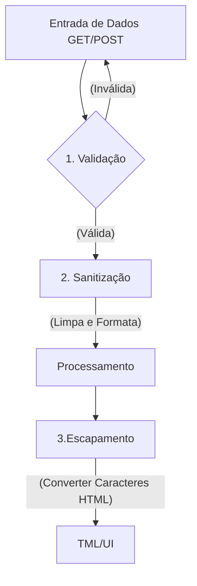

#### **A Ferramenta Principal: `htmlspecialchars()`**

É o principal mecanismo do PHP para neutralizar XSS na camada de Apresentação (UI)

**Como a conversão de entidades HTML funciona?**

| Caractere Original | Entidade HTML Gerada | Efeito no Navegador |
| :---: | :---: | :--- |
| `<` | `&lt;` (*Less Than*) | O navegador exibe `<` na tela, mas **não cria uma tag**. |
| `>` | `&gt;` (*Greater Than*) | O navegador exibe `>` na tela sem fechar tags. |
| `"` | `&quot;` (*Quotation Mark*) | Não quebra atributos HTML `<input value="...">`. |
| `'` | `&#039;` ou `&apos;` | Protege strings envoltas em aspas simples. |
| `&` | `&amp;` (*Ampersand*) | Evita interpretação incorreta de entidades. |


**A Sintaxe no PHP**

```php
string htmlspecialchars(
    string $string,
    int $flags = ENT_QUOTES | ENT_SUBSTITUTE | ENT_HTML5,
    ?string $enconding = "UTS-8"
)
```
- `ENT_QUOTES`: Converte tanto aspas duplas quanto aspas simples
- `ENT_SUBSTITUTE`: Substitui sequências de bytes inválidos por caracteres de substituição Unicodee em vez de retornar uma string vazia
- `ENT_HTML5`; Aplica a tabela de entidade compatíveis com a especificação HTML5
- `UTF_8`: Garante que caracteres de lingua portuguesa como "ç", "ã", "é" sejam preservados sem corrupção.

**A Função helper de Escapamento**

Para não digitar essa linha extensa em todas as partes de saída de texto para HTML, od desenvolvedores profissionais criam uma função auxiliar curta:

```php
function e(string $texto): string{
    return htmlspecialchars($texto, ENT_QUOTES | ENT_SUBSTITUTE | ENT_HTML5, "UTF-8");
}

<P>Comentário: <?= e($cometárioUsuario) ?></p>
<input type="text" name="nome" value"<?= e($nomeUsuário) ?>" />

```

#### **Validação e Sanitização com `filter_var()`**

O PHP possui a biblioteca de filtros nativos `filter_var()`.

```php
<?php
declare(strict_types=1);

// 1. Validação de E-mail
$email = "usuario.teste@senai.br";
if (filter_var($email, FILTER_VALIDATE_EMAIL) !== false) {
    // E-mail válido
}

// 2. Validação de Número Inteiro com Limites (Range)
$idade = "25";
$opcoesIdade = [
    'options' => [
        'min_range' => 16,
        'max_range' => 120
    ]
];
if (filter_var($idade, FILTER_VALIDATE_INT, $opcoesIdade) !== false) {
    // Idade é um inteiro entre 16 e 120
}

// 3. Validação de URLs (Links)
$website = "https://www.sp.senai.br";
if (filter_var($website, FILTER_VALIDATE_URL) !== false) {
    // URL possui protocolo e formato válidos
}

// 4. Validação de Endereço IP
$ip = "192.168.1.100";
if (filter_var($ip, FILTER_VALIDATE_IP) !== false) {
    // IP válido
}

```
---

### Semana 8 - Persistência de Dados com Banco de Dados Relacional (Postgres) e Conexão PDO

**Tema:** Camada de acesso a Dados, Driver PDO (PHP Data Objects), Driver `pdo_pgsql`, Padão Singleton, Isolamento de Credenciais (.env) e Tratamento de Exceções (PDOExecption)

#### **1. Da memoria Volátil ao Banco de Dados**

Em sistemas corporativos de grande porte, arquivos planos (.txt .json) não oferecem a segurança, integridade, concorrência e velocidade necessárias para armazenamento de dados. Então é aqui que o `BackEnd encontra o Banco de Dados Relacional`.

Banco de Dados Relacional Permitem:

- Conectar a lógica de programação server-side ao Sistema de Gerenciamento de Banco de Dados (SGBD)
- Garantindo persistência definitiva e segura dos registros
- Aplicando integridade referencial, contraints, consultas otimizadas e propriedade ACID aprendidas na disciplina de Banco de Dados

> obs: Atomicidade, assegura que cada transação seja única. Consistência, respeite todas as regras, restrições e chaves definidas, garantindo a validade da transação. Isolamento, transações de forma independente. Durabilidade, transações são confirmadas, garantindo a persistência permanente.

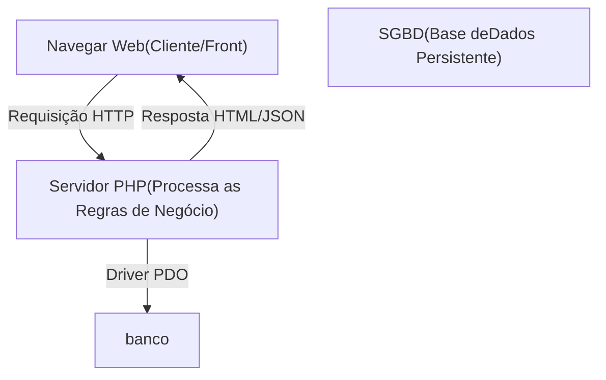

#### **2. O que é PDO (PHP Data Objects)?**

O `PDO` é uma camada de abstração de acesso a dados integrada ativamente ao PHP. El fornece uma interface uniforme e orientada a objetos para se comunicar com multiplos sistemas de banco de dados (PostgresSQL, MySQL, SQLite, OracleSQL, SQLServer)

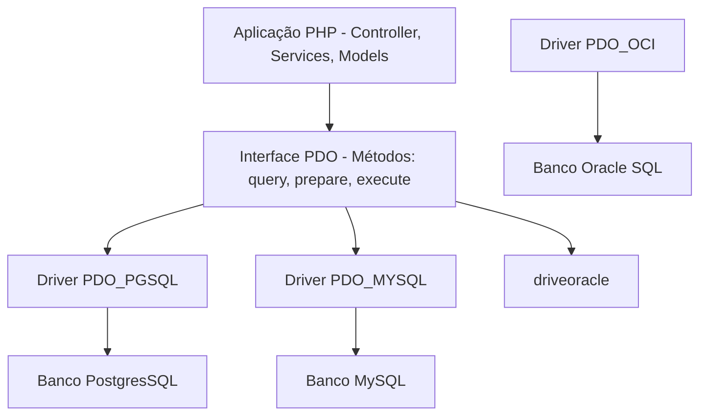

#### **3. Vantagens do uso do PDO**

- **Portabilidade de código**: Os méetodos de conexão, consulta e transações são identicos, independente do banco utilizado. Se o cliente migrar do banco PostgreSQL para outro SGBD, o programador apenas altera a string DSN de conexão, preservando toda a lógica de acesso já criada.
- **Suporte Nativo**: A Prepared Statements: O PDO foi projetado para trabalhar com consultas nativas, oferecendo a defesa contra a ataques de `SQL Injection`
- **Tratamento Orientado a Objetos com Execptions**: Em vez de retornar códigos de erros, o PDO lança uma instância da classe especializada `PDOException`

**A Sintaxe da Conexão PDO: DSN(Data Source Name)**

Para que o PDO saib onde o banco está localizado, em qual porta abrir, utilizamos a strig padronizada `DSN`

```text
pgsql:host=127.0.0.1;port=5432;dbname=seu_banco
    |           |            |           |
    |           |            |           └─ Nome da base de dados relacional (nome do banco)
    |           |            └─Porta padrão do Banco de Dados PostgresSQL(5432)
    |           └─ Endereço IP ou hostname do servidor
    └─ Identificador do driver do SGBD (pgsql) - PostgreSQL
```

#### **4. A Configuração de PDO**

Ao instanciar um objeto PDO, devemos configurar quatro flags essenciais que determinam como o driver se comportará frente a erros e consultas

```php
$opcoes = [
    //1. flag: Lança exceções imadiatamente quando ocorrer qualquer erro SQL
    PDO::ATTR_ERRMODE => PDO::ERRMODE_EXCEPTION,

    //2. Retorna registros apenas com nomes das colunas (Eliminar duplicidade numérica)
    PDO:: ATTR_DEFAULT_FETCH_MODE => PDO::FETCH_ASSOC,

    //3. Desatica emulação e utiliza prepared statements nativos
    PDO:: ATTR_EMULATE_PREPARES => false,

    //4. Limita a 5 segundos para tentar a conexão com o servidor do BD
    PDO:: ATTR_TIMEOUT => 5
];
```

**Detalhamento das Flags**:
- PDO;;ATTR_ERRMODE => PDO::ERRMODE_EXCEPTION : por padão o PDO pode falhar silenciosamente e retorna apenas `false`. Ao ativar o ERR_MODE força o PHP a disparar uma `PDOException`, permitindo que o nosso código interprete qualquer erro em um bloco `try-catch`.
- PDO::ATTR_DEFAULT_FETCH_MODE => PDO::FETCH_ASSOC : por padrão o métodos `fetch()` retorna um array duplicado contendo índices numéricos `[0,1]` e associativos `["id","código_máquina] `. Definir `FETCH_ASSOC`reduz o consumo de memória RAM pela metade e entrega coleções limpas.
- PDO::ATTREMULATE_PREPARES => false : Garante que o PHP envie a consulta e os parâmetros separados diretamente para o planejador do BCD processar, blindando a aplicação contra ataques sofisticados de `SQL_injection`.

---

#### **5. Proteção de Credenciais**

Um dos erros mais graves cometidos por desenvolvedores iniciantes e escrever dados de conexão diretamente dentro do códio:

```PHP
// Péssima prática de código
$pdo = new PDO("pgsql:host=localhost;dbname=producao", "postgres", "senha123456");
```

Se esse arquivo for versionado e enviado para o GitHub:
1.Suas senhas de produção ficam publicas
2. Robôs malicioso varrem repositóros à produra de crendenciais expostas para invadir banco de dados e sequestrar informações (ataques e Ransoware)
3. A empresa é penalizada por violação da **LGPD(Lei geral de Proteção de Dados)**

**A Abordagem Segura: usando Arquivos de Configuração Isolados (`.ini` ou `.env`)**

Isolamos as credenciais em um arquivo externo protegido que **nunca entra no Git**:

```ini
; confi/database.ini
[database]
db_driver   = pqsql
db_host     = 127.0.0.1
db_port     = 5432
db_name     = producao
db_user     = postgres
db_pass     = senha12345
```

No arquivo `.gitignore`do projeto:

```text
config/database.ini
.env
logs/*.log
```
---

#### **6. Padão Singleton de Conexão**

Imagine um aplicação Web com 500 usuários simultaneamente. Se cada script, finção execultar `new PDO()` sempre que precisar consultar o banco, teremos milhares de conexões de redes abertas desnecessariamente.

No SGBD(PostgreSQL), cada conexão abarte cria um processo no sistema operacional dedicado. Abrir conexões repetidas esgota rapidamente o limites configurando (`max_connection`) do BCD gerando erro:
`Fatal Error; sorry, too many clients already`

**Como o Singleton Rsolve Issso**

O padrão `Singleton` garante que **apenas uma única instancia de PDO exista por requisição**, reutilizando-a em qualquer ponto do sistema.

**As Confiurações do Sinlgeton**:
1. **Construtuor Privado** (`private function_constructor`): Impede que outros arquivos instanciem uma nova conexão
2. **Propriedade Estáticas Privadas** (`private static ?PDO $instancia = null`): Armazena a conexão aberta.
3. **Método de Acesso Estático Público** (`public static function obterConexão():PDO`): A conexão é criada pelo método, se já existir uma conexão apenas devolve a conexão já existente, sem a necessidade de criar uma nova.
4. **Bloqueio de Clonagem e Desrealização** (`_clone` e `_wakeup`): Garante que ninguém oonsiga duplicar o objeto de conexão.
---

#### **7. Tratamento de Falhas com `PDOException`**

Quando uma tentativa de conexão falha (servidor desligado, senha incorreta, porta inacessível), o PDO lança uma Exceção (`PDOException`). Então devemos tratar esse erro.

**Práticas Recomendas de Segurança** (AppSec):

* **Para o Usuário**: Exibir mensagens amigáveis e genéricas: *Não foi possível processar sua solicitação. tente novamente mais tarde*
* **Para a Equipe de Desenvolvimento**: Gravar os detalhes técnicos completos com timestamp em uma arquivo de log seguro (`logs/database.log`).