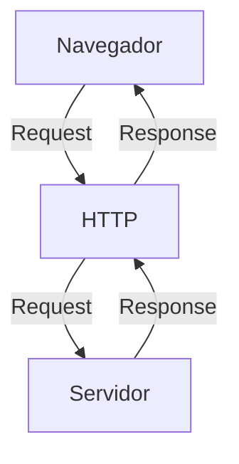
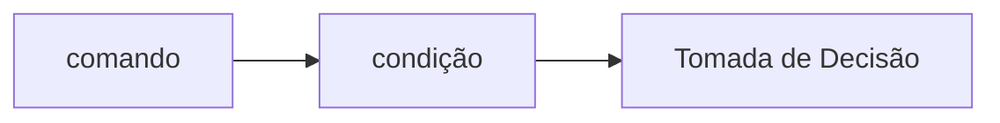
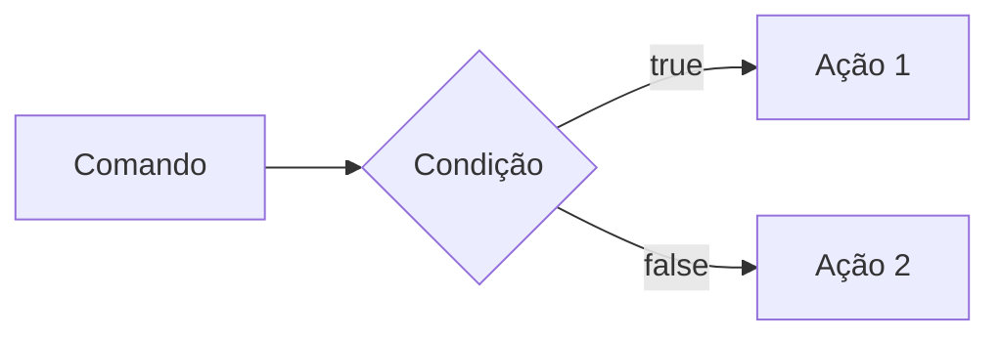
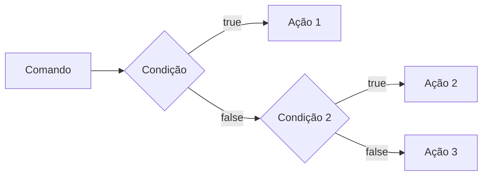
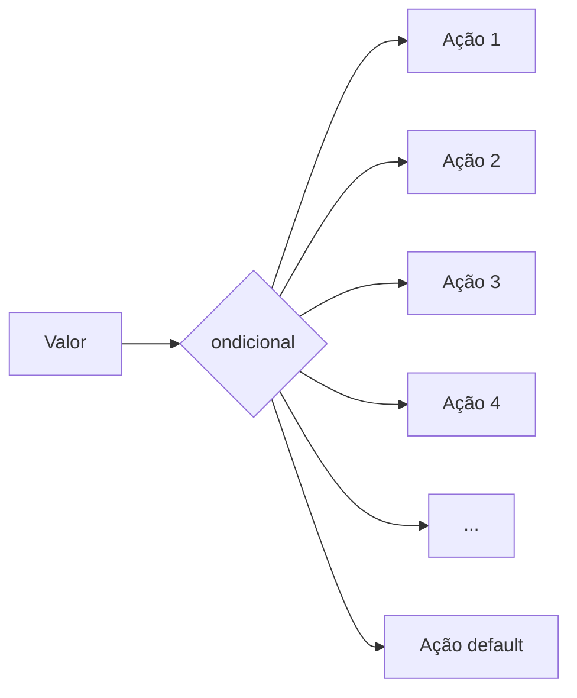

# Curso BackEnd -  1º Semestre - 105h

Prof. Diogo Barbosa

Escola SENAI Americana 

2º Semestre 2026

## Objetivos do Curso

- Desenvolver Aplicações web Server Side, utilizando a linguagem PHP;
- Aplicar Sintaxe nativa Php Vanilla;
- Manipulação HTTP;
- Persistência de Dados(Armazenamento em BD);
- Segurança contra SQL Injection/CSRF;
- Refatoração em POO (Programação Orientada Objeto);
- Arquitetura MVC;
- Utilização do FrameWork Laravel;

## Cronograma do Semestre

Carga Horária: 105h

Duração: 20 Semanas

### Semana 1: Introdução ao BackEnd e Configuração do Ambiente PHP

#### O que é BackEnd

O back-end é a parte de um site ou aplicativo que o usuário não vê, mas que faz tudo funcionar por trás das telas.

- Guarda e organiza informações em um banco de dados;
- Confere se o login e a senha estão corretos;
- Calcula valores, como o frete ou o total de uma compra;
- Garante que os dados de um usuário não apareçam para outro;
- Faz o sistema suportar muitas pessoas usando ao mesmo tempo, sem travar.

As principais linguagens utilizadas no desenvolvimento back-end são PHP, JavaScript/TypeScript, Python, Java, Kotlin, Go (Golang), C# e Rust. 

O backend é o "cérebro" oculto de um site ou aplicativo. Ele roda em um servidor e cuida de tudo o que o usuário não vê na tela.

**As 3 partes básicas de todo backend:**

1. **Servidor:** o "computador" que fica ligado esperando pedidos (requisições);
2. **Banco de dados:**  onde as informações ficam guardadas (usuários, produtos, mensagens, etc.);
3. **Lógica de negócio:**  as regras do sistema (ex: "não deixa comprar se não tiver estoque").

**O Mercado de Trabalho em Back-end**

O desenvolvimento Back-end é uma das áreas mais cruciais da Tecnologia da Informação. 

- Com a transformação digital acelerada, empresas de todos os portes e setores dependem de infraestruturas sólidas e seguras. 

- Setores de Atuação: Bancos, hospitais, e-commerces, logística, indústrias, startups e órgãos públicos utilizam Back-end para suportar suas operações críticas.

- Fatores de Crescimento: O avanço da computação em nuvem, aplicativos móveis, Big Data e IA impulsiona continuamente a busca por profissionais da área.

- Modelos de Trabalho: Alta flexibilidade com vagas presenciais, híbridas e remotas (inclusive com oportunidades internacionais).

#### Ciclo de Vida da Requsição HTTP

##### O que é HTTP

**HTTP**, Hypertext Transfer Protocol, é um protocolo de comunicação utilizado para transferência de informações na WWW(World Wide Web) e em outros sistemas de Redes.

O HTTP é a base para que o cliente e um servidor web troquem informações. Ele permite a requisição e a respostas de recursos, como imagens, arquivos e as própias páginas web, por meio de mensagens padrão (protocolo).

##### Como Funciona o HTTP

1. O cliente estabele contato com o servidor, encamihando uma requisição HTTP;
2. Nessa Requisição o cliente especifica o método pretendido (read-GET, create-POST, update-PUT/PATCH, delete-DELETE)
3. o Servidor processa e responde com uma mensagem HTTP, com os recursos solicitado.


---
#### Como funciona na prática o BackEnd
- **Ação do usuário:** Envia uma solicitação pela UI (Interface do Usuário). Exemplo de UI: Tela do celular, Navegador da Internet, Alexa, ...
- **Envio da requisição:** A UI transforma ação do usuário em uma requisição HTTP.
- **O Processamento BackEnd:** o Código BackEnd recebe o pedido, valida os dados e decide o que fazer (Ex: consulta uma informação no banco de dados).
- **Resposta:** o servidor devolve o resultado para UI (Ex: Um login autorizado, uma compra confirmado, uma música, ...).

## Tipos de Requisição HTTP
Os tipos de requisição HTTP indicam uma ação que o usuário deseja executar no servidor. As principais ações são: 

- **GET**: Pede dados de um lugar especifico. "Não Faz Alterações no Servidor"
- **POST:** Envia dados novos para *criar* algo ou processar informações.
- **PUT/PATCH:** Modificar dados ja existentes. *PUT* Atualização Total dos dados. *PATCH* Atualização Parcial dos dados.
- **DELETE:** Apaga um dado do Servidor


---

### Iniciando o PHP

### O que é PHP

**PHP** (Hypertext PreProcessor) é uma liguagem de programação interpretada e open source, focada no desenvolvimento de sistemas para web, pode ser usada junto com HTML para criação de págians web dinâmicas.

### Instalando o PHP

- Fazer o Download do PHP (php.net);
- ZIP - Non Thread Safe 8.5
- Descompactar o arquivo do PHp na pasta C:\src\php (Para descompactar, usar 7zip)
- Modificar o arquivo php.ini-development para => php.ini (criar as configurações do PHP na máquina) - adicionar ou remover funcionalidades do PHP
- Adicionar a pasta do PHP (C:\src\php) as Variaveis de Ambiente do Sitema (PATH) 
- Verificar a instalação rodando o comando php --version

### Contextualizando o PHP

O PHP de fato é uma das linguagens de programação mais populares da atualidade. Ela permite que você crie aplicações web robustas, muito simplificada direto ao ponto. Sem contar que a linguagem traz diversos recursos que facilitam e aceleram o processo de desenvolvimento de sites e sistemas para web. E além do mais, ela ainda tem um ótimo ecossistema, uma excelente comunidade e um grande mercado de trabalho.

### Criando minha primeira aplicação em PHP

Criando um Hello, World!!!

### Criando o perfil de PHPVanilla

-> Profile -> New Profile
-> Extensions:
- PHP IntePhense (A do elefantinho) : Autocomplear (snipets)
- PHP Debug (Xdebug): Acha erros em linha de código
- PHP CS FIXER: Formatação padrão do código (identação)
- PHP Serve: Sobe um serivdor local para acompanhamento em tempo real
---
### Estudo de Constantes e Variáveis em PHP 

Declarar variáveis é alocar um espaço na memória que permite a inclusão e manipulaçã de dados.

**Variáveis**

- devem ser declarados usando "$" antes do nome da variável
- podem ser String, Numérica (Integer e floar), Booleanas e Nulas. Não permite a declaração de Undefined
- são não tipadas (não precisa declarar um tipo na criação), a tipagem é atribuida ao adicionar o valor
- usar o "declare(strict_types=');" na primeira linha do arquivo ; => blindar o sistema contra conflitos de tipos de variáveis.

**Constantes**

- não podem ser modificadas ou redeclaradas após a criação
- pode ser criada usando "const" ou "define"
- não permitem interpolação

---

### Semana 2 - Operadores em PHP (Aritméticos, Relacionais e Lógicos)

### Estudo de Operadores 

 **Aritméticos**: São usados para realizar cálculos.
 
 | Operador | Nome | Exemplo | Resultado |
 | - | - | - | - |
 | + | Adição| 10 + 5 | 15 |
 | - | Subtração | 10 - 5 | 5 |
 | * | Multiplicação | 10 * 5 | 50 |
 | / | Divisão | 10 / 5 | 2 |
 | % | Módulo (Resto) | 10 % 3 | 1 (10 div 3 da 3, sobra 1) |
 | **| Expoente | 2 ** 3 | 8(2 elevado a 3) |
 
 
 `obs:` O Operador é o melhor  amigo de um programador, permite ordenar listas e organizar fila e pilhas.

 **Relacionais**: São utilizados para comparar e relacionar dois ou mais valores ou informações, o resultado de uma operação relacional é sempre uma booleana (true, false)

 | Operador | Nome | Exemplo | Resultado |
 | - | - | - | - |
 | < | Menor que | 5 < 10 | True |
 | > | Maior que | 5 > 10 | False |
 | <= | Menor ou igual | 10 <= 5 | False
 | >= | Maior ou igual | 18 >= 18 | True |
 | == | Iguais | "10"==10 | False |
 | === | Igualdade Estrita | "10"===10 | False |
 | != | Diferente | "10"!=10 | False |
 | !== | Diferença Estrita |"10"!==10 | True |

 **Lógicos**: Permite a combinação entre sentenças.

 - operador `AND` (E) => && : para o resultado ser verdadeiro, TODAS as Combinações precisam ser verdadeiras
  - true && true => true
  - true && false => false

  - Operador `OR` (OU) => || : para o resultado ser verdadeiro, basta APENAS UMA condição ser verdadeira
  - false || true => true
  - false || false => false

  - Operador `NOT` (Não) => ! : Inverte a lógica da Sentença
  - !true => false
  - !false => true 
  --- 
### Semana 3 - Estrutura de Controle de Dados (Condicionais e Repetição)

- **Conteúdo**: Extruturas `if`, `else`,`elseif`, operadores ternários, `match` => substituto do `switch/case`, loops `for`, `while`, `do-while` e `foreach`

#### Estrutura de Controle de Dados ajudam no precesso de automatização em programa e sistemas

#### Condicionais (IF, ELSE, ELSEIF)

- **Forma de Uso**: 

- Uso do `if` apenas:
Exemplo: aplicar uma desconto do 10% em comprar acima de 100 reais;



```php
if ($valorCompra > 100) {
    $valorCompra = $valorCompra * 0.1
}
```

- Uso do `if` seguido do `else`
Exemplo: aplicar um desconto de 10% para compras de acima de 100 reais e 5% para as demais compras



```php
 if($valorCompra > 100) {
    $valorFinal = $valorCompra*0.1;
 } else{
    $valorFinal = $valorCompra*0.05;
 }

 ```

- Uso do `elseif` (Encadeado)
Exemplo: Compras acima de 200 reais tem 15% de desconto, acima de 100 reais 10% de desconto e qualquer outra compra vai ter 5% de desconto



```php

if($valorCompra > 200){
    $valorFinal = $valorCompra*0.85;
} elseif($valorCompra > 100) {
    $valorFinal - $valorCompra*0.9;
} else {
    $valorFinal = $valorCompra*0.95;
}

```

*Obs*: sempre usar `elseif` para situações que precisam de mais de uma condição, ou seja, fazer encadeamento das condições.

#### Operadores Ternários
Um atalho para a estrutura condicional `if/else`, normalmente escrito em uma única linha de código

` condição ? verdadeira : falso`

Perfeito para decisões curtas de uma linha de comando
Exemplo: Verificar se a pessoa é maor de idade (18)

```php

$idade = 20;
//O formato é : (Condição) ? Verdadeiro : Falso;

$status = ($idade >= 18) ? "Maior de Idade" : "Menor de Idade;

```

#### Expressão Condicional `match` (PHP 8)

No mercado de PHP atual não se usa mais uma de zena de `if/elseif` para checar valores fixos, e o antgo `switch/case` caiu em desuso. Agora usamos o `match`. Ele retorna diretamente o resultado.


