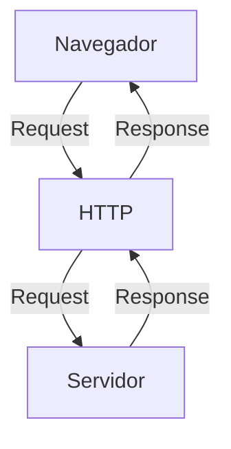

# Curso BackEnd - 1° Semestre - 105h

Prof. Diogo Barbosa 

Escola SENAI Americana

2° Semestre 2026

## Objetivos do Curso 

- Desenvolver aplicações  web server Side, utilizando linguagem PHP;
- Aplicar Sintaxe nativa Ph´p Vanilla/
- Manipulação HTTP;
- Persistência de Dados (Armazenamento em BD);
- Segurança contra SQL Injection/CSRF;
- Refatoração em POO (Programação Orientada Objeto);
- Arquitetura MVC;
- Utilizando do FrameWork Laravel;

## Cronograma do Semestre

Carga Horária: 105h

Duração: 20 Semanas

### Semana 1: Introdução ao BackEnd e Configuração do Ambiente PHP

#### O que é BackEnd? 

O back-end é a parte de um site ou aplicativo que o usuário não vê, mas que faz tudo funcionar por trás das telas.

- Guarda e organiza informações em um banco de dados;
- Confere se o login e a senha estão corretos;
- Calcula valores, como o frete ou o total de uma compra;
- Garante que os dados de um usuário não apareçam para outro;
- Faz o sistema suportar muitas pessoas usando ao mesmo tempo, sem travar.

As principais linguagens utilizadas no desenvolvimento back-end são PHP, JavaScript/TypeScript, Python, Java, Kotlin, Go (Golang), C# e Rust. 

O backend é o "cérebro" oculto de um site ou aplicativo. Ele roda em um servidor e cuida de tudo o que o usuário não vê na tela.

**As 3 partes básicas de todo backend:**

1. **Servidor:** o "computador" que fica ligado esperando pedidos (requisições);
2. **Banco de dados:**  onde as informações ficam guardadas (usuários, produtos, mensagens, etc.);
3. **Lógica de negócio:**  as regras do sistema (ex: "não deixa comprar se não tiver estoque").

**O Mercado de Trabalho em Back-end**

O desenvolvimento Back-end é uma das áreas mais cruciais da Tecnologia da Informação. 

- Com a transformação digital acelerada, empresas de todos os portes e setores dependem de infraestruturas sólidas e seguras. 

- Setores de Atuação: Bancos, hospitais, e-commerces, logística, indústrias, startups e órgãos públicos utilizam Back-end para suportar suas operações críticas.

- Fatores de Crescimento: O avanço da computação em nuvem, aplicativos móveis, Big Data e IA impulsiona continuamente a busca por profissionais da área.

- Modelos de Trabalho: Alta flexibilidade com vagas presenciais, híbridas e remotas (inclusive com oportunidades internacionais).

#### Ciclo de Vida da Requisição HTTP

##### O que é HTTP

**HTTP**, Hypertext Transfer Protocol, é um protocolo de comunicação utilizado para transferência de informações na WWW (World Wide Web) e em outros sitemas de Redes.

o HTTP é a base para que o cliente e um sevidor web troquem informações. Ele permite a requisição e a respostas de recursos, como imagens, arquivos e as próprias páginas web, por meio de mensagens padrão (protocolo).      

#### Como funciona o HTTP 

1. O cliente estabelece contato com o servidor, encaminhando uma requisicção HTTP;
2. Nessa requisição o Cliente especificao o método pretendido (read-GET, create-POST, update-PUT/PATCH, delete-DELETE);
3. o Servidor processa e responde com uma mensagem HTTP, com os recursos solicitados.

---
#### Como funciona na prática

- **Ação do usuário:** Envia uma Solicitação pela UI (Interface do Usuário). Exemplo de UI: Tela do celular, navegador da internet, Alexa...
- **Envio da Requisição:** A UI transforma a ação do usuário em uma Requisição HTTP
- **O Processamento BackEnd:** O Código BackEnd recebe o pedido, valida os dados e decide o que fazer (Ex: consulta uma informação no banco de dados)
- **Resposta:** O servidor devolve o resultado para a UI (Ex: Um login autorizado, uma compra confirmada)

#### Tipos de Requisição HTTP

Os tipos de requisição HTTP indicam a ação que o usuário deseja executar no servidor. As principais ações são: 
 
- **GET:** Pede dados de um lugar específico: "Não faz alterações no servidor"
- **POST:** Envia dados novos para *criar* ou processar informações.
- **PUT/PATCH:** Modificar dados já existentes. *PUT* Atualização total dos dados. *PATCH* Atualização parcial dos dados.
- **DELETE:** Apaga um dado do Servidor 

---

#### Iniciando o PHP

##### O que é PHP 

**PGP** (Hypertext PreProcessor) é uma linguagem de programação interpretada e open source, focada no desenvolvimento de sistemas para web, pode ser usada junto com HTML para criação de páginas web dinâmicas.

##### Instalando o PHP

- Fazer o dowload do PHP (php.net);
- ZIP - Non Thread Safe 8.5
- Descompactar o arquivo do PHP na pasta C:\src\php (Para descompactar, usar o 7Zip = Melhor) => Nunca salvar arquivos na raiz do sistema (C:)
- Modificar o arquivo php.ini-development para => php.ini (criar as configurações do PHP na Máquina) - adicionas ou remover funcionalidade php
- Adicionar a Pasta do PHP (C:\src\php) as Variáveis de ambiente do Sistema (PATH)
- Verificar a instalação rodando o Comando php --version

#### Contextualizando o PHP 
 
 O PHP de fato é uma das linguagens de programação mai s populares da atuualidade. Ela permite que você crie aplicações web robustas, de uma maneira muito simplificada e direto ao ponto.
 Sem contar que a linguagem traz diversos recursos que facilitam e aceleram processo de desnvolvimento de sites e sistemas pra web. E além do mais, ela tem um ótimo ecossistema, uma exclente comunidade e um grande mercado de trabalho. 

 #### Criando minha primeira aplicação em PHP

 Criando um Hello, World!!!

 #### Criando o Perfil de PHPVanilla
 
 -> Profile -> New Profile
 -> Extensions: 
 - PHP IntelePhense (A do Elefantinho): Autocompletar (Snipets)
 - PHP Debug (Xdebug): Acha erros em linha de código
 - PHP CS FIXER: Formatação padrão do código
 - PHP Server: Sobre um servidor local par a acompanhamento em tempo real

 php -S localhost:8080